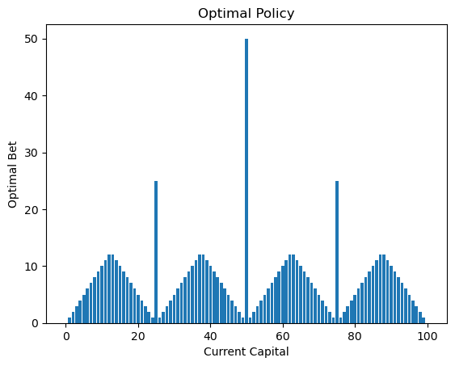

# Markov Decision Processes: Value Iteration vs. Policy Iteration

A from-scratch implementation of two classic MDP problems — the **Gambler's Problem** and
**Gridworld** — solved with **Value Iteration** and **Policy Iteration**, and a comparison of the two
algorithms' convergence behaviour and solution quality.

Course report, Department of Computer Science, The Chinese University of Hong Kong.
Authors: Dillon Adli Gunawan, Chi Hang Po

## Project

Both problems are modelled as MDPs — states, actions, transition model, rewards, discount factor —
and solved with no RL libraries: only plain Python dictionaries, NumPy and Matplotlib. The point is
to compare how the two exact solution methods behave on the same problem.

**Gambler's Problem.** A gambler with capital `x` bets to reach `N = 100`. A bet of `n` wins with
probability `p = 0.4` and loses otherwise; reward is 1 only on reaching 100. States are capital
`0…100`, actions are bets `0…min(x, 100−x)`.

**Gridworld.** An agent navigates a grid to a goal (+1) while avoiding bad terminals (−1) and walls,
paying a −0.04 living cost per step. Movement is stochastic: the intended direction succeeds with
probability 0.8, and the agent slips into each perpendicular direction with probability 0.1. Two
layouts are run — a 4×4 world (15 states) and a 7×7 maze (40 states, two goals, three bad terminals)
— each at γ = 0.9 and γ = 0.99.

## Key findings

**Gambler's Problem** (N = 100, p = 0.4):

| Algorithm | γ | Time (s) | Iterations |
| --- | --- | --- | --- |
| Value Iteration | 1 | 5.56 | 63 |
| Policy Iteration | 1 | 4.54 | 9 |
| Value Iteration | 0.9 | 4.49 | 53 |
| Policy Iteration | 0.9 | 2.14 | 9 |

**Gridworld** (γ = 0.9 / γ = 0.99):

| Map | Algorithm | Time γ=0.9 | Iters | Time γ=0.99 | Iters |
| --- | --- | --- | --- | --- | --- |
| 4×4 | Value Iteration | 0.0368 | 32 | 0.0509 | 41 |
| 4×4 | Policy Iteration | 0.0885 | 5 | 0.2560 | 5 |
| 7×7 | Value Iteration | 0.3183 | 30 | 0.5971 | 53 |
| 7×7 | Policy Iteration | 0.6880 | 6 | 3.4641 | 8 |

- **Both algorithms converge to the same optimal policy** — value differences are negligible, and the
  Gridworld runner verifies the policies match automatically.
- **Policy Iteration needs far fewer iterations** (9 vs. 63 on the Gambler's Problem; a handful vs.
  32 on the 4×4 grid), because each iteration does a full policy evaluation.
- **But those iterations are expensive.** Policy Iteration wins overall on the Gambler's Problem,
  while Value Iteration is cheaper per iteration and scales better on the larger 7×7 maze.
- **The discount factor changes the strategy, not just the numbers.** In the Gambler's Problem γ < 1
  produces a policy that bets whatever is needed to reach 100 in one go, while γ = 1 favours smaller,
  safer bets. In the 7×7 maze, raising γ to 0.99 flips several arrows in the bottom-left corridor as
  the agent becomes more far-sighted; the 4×4 policy is stable under both.

Full derivations, algorithm pseudocode and further discussion are in [Report/Report.pdf](Report/Report.pdf).

### Gambler's Problem: optimal policy

Optimal bet at each capital level, for p = 0.4 and γ = 1. Both notebooks produce this plot, and the
two are byte-identical — the algorithms agree exactly. The spikes are at capital 25, 50 and 75, where
the policy stakes exactly enough to jump to the next "safe" halfway point; between them the bet ramps
up and back down in a sawtooth.



### Gridworld: sample output

Running `mdp_v2.py` prints the value function and policy for each grid. Abridged output for the 4×4
world at γ = 0.9 (`★` goal, `✗` bad terminal, `█` wall):

```
>>> Running Value Iteration...
✓ Converged in 32 iterations
✓ Time elapsed: 0.0164 seconds

>>> Running Policy Iteration...
✓ Converged in 6 iterations
✓ Time elapsed: 0.0416 seconds

=========================================
         VALUE ITERATION RESULT
=========================================
-----------------------------------------
|  1.12   |  1.37   |  1.78   |  GOAL!  |
|    →    |    →    |    →    |    ★    |
-----------------------------------------
|  0.85   |  WALL   |  1.16   |  BAD!   |
|    ↑    |    █    |    ↑    |    ✗    |
-----------------------------------------
|  0.70   |  0.73   |  0.90   |  0.50   |
|    ↑    |    →    |    ↑    |    ↓    |
-----------------------------------------
|  0.57   |  0.60   |  0.72   |  0.57   |
|    ↑    |    ↑    |    ↑    |    ←    |
-----------------------------------------

COMPARISON SUMMARY
------------------------------------------------------------
Iterations to converge         32              6
Time (seconds)                 0.0164          0.0416
Optimal policies match         True
Max value difference           0.000000
```

The run ends with a summary across all four configurations:

```
Grid / γ                       VI iters   PI iters
----------------------------------------------------------------------
4x4, γ=0.9                     32         6
4x4, γ=0.99                    41         4
7x7, γ=0.9                     30         6
7x7, γ=0.99                    53         5
```

Policy Iteration starts from a randomly initialised policy, so its iteration count varies slightly
between runs; Value Iteration is deterministic.

## Repository layout

```
Code/
  Gambler's Problem/
    val_iteration.ipynb   Value Iteration + optimal-bet plot
    pol_iteration.ipynb   Policy Iteration + optimal-bet plot
  Grid Problem/
    mdp_v2.py             GridWorld env, both solvers, ASCII visualiser, comparison driver
Report/
  Report.pdf              Full report
assets/
  gambler_optimal_policy.png
```

## Setup

```bash
python -m venv .venv
# Windows: .venv\Scripts\activate
source .venv/bin/activate
pip install numpy matplotlib jupyter
```

### Running

**Gridworld** — the script is self-contained and runs the whole experiment grid (4×4 and 7×7, each at
γ = 0.9 and γ = 0.99), printing values, policies and a timing comparison:

```bash
python "Code/Grid Problem/mdp_v2.py"
```

The output uses arrow and box-drawing characters. On Windows, run `chcp 65001` first (or set
`PYTHONIOENCODING=utf-8`) so the console renders them.

To try your own layout, set the special states on a `GridWorld`, refresh the reward table, and pass it
to `compare_algorithms()` (`create_large_grid()` in the script is the worked example):

```python
from mdp_v2 import GridWorld, compare_algorithms

grid = GridWorld(rows=5, cols=5, gamma=0.95)
grid.goal_states = [(0, 4)]           # +1
grid.obstacle_states = [(2, 4)]       # -1
grid.blocked_states = [(1, 1), (2, 1), (3, 3)]   # walls
grid.rewards = grid._initialize_rewards()        # required after changing states

results = compare_algorithms(grid)
print(results['value_iteration']['iterations'], results['policy_iteration']['iterations'])
```

**Gambler's Problem** — open either notebook and run all cells:

```bash
jupyter notebook "Code/Gambler's Problem/val_iteration.ipynb"
```

Parameters live in the first cell (`p`, the state space `S`, and the action set `A`); the discount
factor is an argument to the solver. To reproduce the γ = 0.9 rows above:

```python
p = 0.4                       # win probability, first cell
S = {i for i in range(0, 101)}  # capital 0…100, first cell

optimV, iterations = Value_Iteration(S, A, P, R, discount_factor=0.9)
policy, iterations = Policy_Iteration(S, A, P, R, discount_factor=0.9)
```

Both default to `discount_factor=1`. Expect a runtime of several seconds — the solvers sum over the
full state space for every state-action pair.
